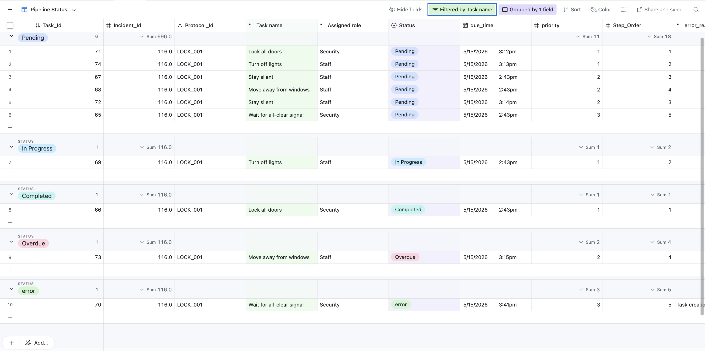

# AI Capstone Emergency Response Coordinator

AI-powered emergency response coordination system that classifies incidents, generates protocol-based emergency tasks, and tracks response workflows using Airtable, n8n, and Flowise AI.

---

## Project Overview

This project was developed as part of an AI Capstone course to improve emergency response coordination using workflow automation and AI-assisted incident classification.

The system processes incoming emergency incident reports, classifies the emergency type using AI, matches the correct emergency response protocol, generates response tasks automatically, and tracks workflow progress through Airtable dashboards.

---

## Features

- AI-powered incident classification
- Automated emergency task generation
- Airtable workflow tracking and monitoring
- Protocol-based emergency response automation
- Priority-based routing logic
- Error handling and workflow monitoring
- Dashboard views for response coordination
- Integration between Airtable, n8n, and Flowise

---

## Workflow Pipeline

Incident Reports  
↓  
AI Incident Classification  
↓  
Protocol Matching  
↓  
Protocol Step Retrieval  
↓  
Emergency Task Generation  
↓  
Dashboard Monitoring & Tracking

---

## Technologies Used

| Technology | Purpose |
|---|---|
| Airtable | Database and dashboard management |
| n8n | Workflow automation |
| Flowise AI | AI classification and routing |
| GitHub | Version control and documentation |

---

## Repository Structure

```text
.github/
component-1-protocol-knowledge-base/
component-2-incident-classifier/
component-3-task-assignment-and-tracking/
component-4-integration-testing-and-presentation/
data/
docs/
README.md
```

## Component Responsibilities 

### Component 1 — Protocol Knowledge Base

Stores emergency response protocols, protocol metadata, and ordered response steps.

### Component 2 — Incident Classifier

Uses AI workflows to classify incoming emergency reports and assign matching protocol IDs.

### Component 3 — Task Assignment and Tracking

Generates emergency response tasks, assigns roles, tracks workflow status, and manages Airtable dashboard views.

### Component 4 — Integration Testing and Presentation

Performs end-to-end workflow testing, validates integrations, and prepares final project documentation and demonstrations.


---

## Dashboard Views

### Pipeline Status View

Displays the current workflow status of emergency response tasks for monitoring and coordination purposes.

### Error Monitor View

Tracks failed workflow actions and identifies tasks requiring troubleshooting or manual review.

### Kanban Task Board

Provides a visual workflow management interface grouped by task status.


---

## Example Emergency Types

* Fire Emergencies
* Medical Emergencies
* Lockdown/Security Threats


---

## Future Improvements

* Real-time automatic workflow triggering
* Improved AI confidence scoring
* Advanced retry and recovery logic
* Notification integrations
* Expanded emergency protocol coverage


---

## Contributors

* Astra
* Hala
* Farida
* MD


---


